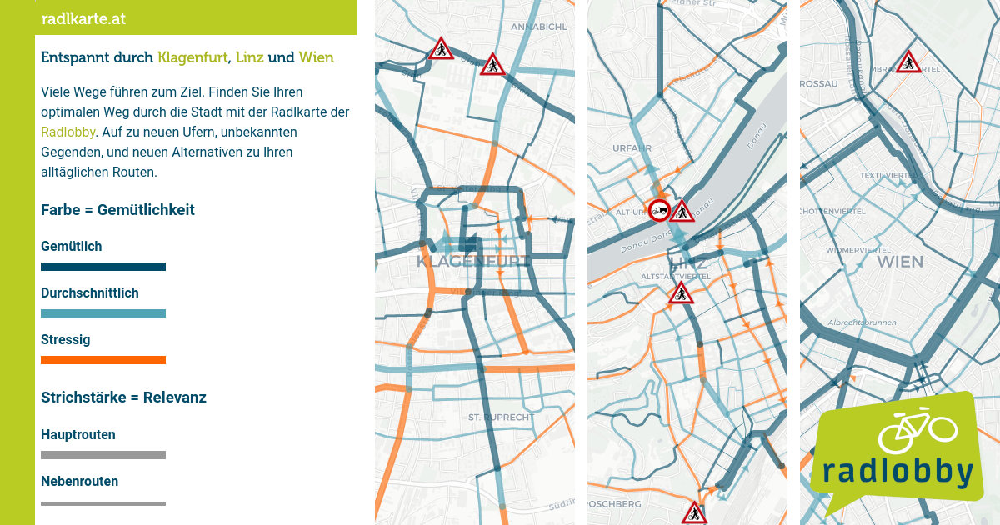

# radlkarte.at

Website for desktop, tablet & smartphone usage with the goal to provide useful (route) information for cyclists.

> If you use the software and/or route data the preferred way to credit is: **© radlkarte.at - Radlobby Österreich**

## Features

- Show recommended bicycle routes
  - Three quality types of route segments: calm, medium, stressful
  - Three importance levels of route segments: main, regional, local
    - Hide parts of the recommended routes when zooming out (for a better overview)
  - Special properties of the routes
    - Oneway (arrow)
    - Steep (bristles)
    - Unpaved (dotted lines)
- Automatically switch to the bicycle routes of the currently viewed region
- Show problematic points along the route where dismounting or usage of heavy/wide bicycles may not be possible
- GPS localization (especially useful for mobile devices)
- Geocoding (address search)

## Route Data

Route data is stored in `GeoJSON` format with the following attributes.

### Line Attributes

**Mandatory**:
- `priority`=`0` (highest), `1` (medium), `2` (lowest)
- `stress`=`0` (no stress), `1` (medium), `2` (a lot of stress)

**Optional** (omitting the attributes means 'no'):
- `oneway`=`yes`: route only legal in one direction
- `steep`=`yes`: very steep, e.g. more than  5-6%, but excluding short ramps
- `unpaved`=`yes`: dirt, gravel or extremely uneven surfaces even though they are paved

### Point Attributes

- `dismount`=`yes`: bicycle must or should be pushed (in at least one direction), either due to legal restrictions or because it's a very dangrous spot
- `nocargo`=`yes`: not feasible for heavy/extra-long/extra-wide bicycles, e.g. cargo bicycles or bikes with trailers due to e.g. stairs or chicanes
- `warning`=`yes`: problematic location, should alwys be combined with the `description` attribute
- `description`: string explaining details shown to the users in a popup

### Edit Instructions

1. [Download JOSM](https://josm.openstreetmap.de)
2. Add [josm-radlkarte-style.mapcss](data/josm-radlkarte-style.mapcss) in `edit > preferences > map settings (3rd buttom from the top) > map paint styles`
3. Load an existing radlkarte `GeoJSON` file, e.g. [radlkarte-example.geojson](data/radlkarte-example.geojson), or create a new layer
4. Edit routes
5. Save the result as `GeoJSON` (not as `.osm`!)
6. Prepare (minify, add bbox,..) the .geojson with [prepare_geojson.py](data/prepare_geojson.py)

## License

The license for all our code and data is [here](LICENSE).

Obviously this excludes libraries (like leaflet, font-awesome or jquery) and the fonts.

Other exceptions:
- bicycle repair station icon based on icon taken from the [OpenStreetMap-carto](https://github.com/gravitystorm/openstreetmap-carto) style licensed under CC0 public domain
- bicycle tube vending icon based on icon taken from https://github.com/cyclosm/cyclosm-cartocss-style licensed under BSD-3-Clause license
- bicycle pump icon based on icon from https://github.com/osmandapp/OsmAnd-resources
